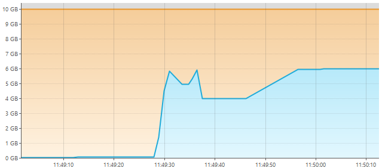
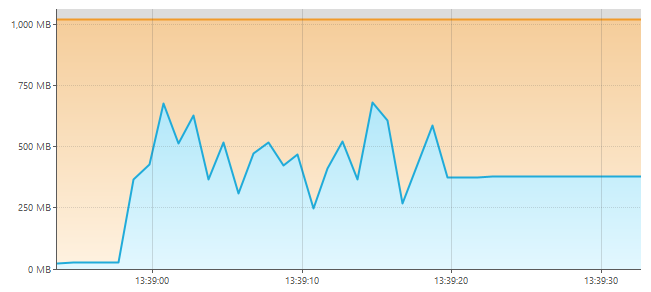
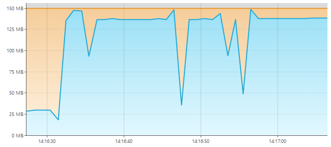
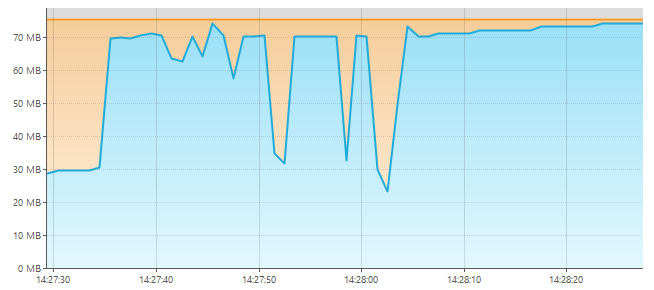

# 06-03-2026 NOTES

## NOTE 1: max lines supported by each implementation

### StringBuilderTxtFileGenerator
- Max lines supported is approximately `37M lines`.
  - Anything larger than that results in `java.lang.OutOfMemoryError: Required array length 2147483639 + 25 is too large`.
  - The OutOfMemory is given even if the program didn't reach the heap limit.
  - The heap size was 10GB. The program stopped at 6GB. **So, is not a question of memory, it is something else !!**
- It took around `24_079 ms` to generate and write content into file.

### SimpleTxtFileGenerator
- Max lines supported is approximately `37M lines`.
    - Anything larger than that results in `java.lang.OutOfMemoryError: Requested string length exceeds VM limit`.
    - The OutOfMemory is given even if the program didn't reach the heap limit.
    - The heap size was 10GB. The program stopped at 5GB. **So, is not a question of memory, it is something else !!**
- It took around `22_392 ms` to generate and write content into file.

### ChunkTxtFileGenerator

- It took around `10_892 ms` to generate and write `37M lines` into file.
- Not only it took less time, but also less memory than the other generators

---

- It took around `20_470 ms` to generate and write `74M lines` into file.
- It took nearly double time of `37M lines`, but same memory usage.

---

- I set heap max size `from 10GB to 1GB`.
- It took around `19_048 ms` to generate and write `74M lines` into file.
- For some reason, it took less time and memory `(<750MB)`.

---

- I set heap max size `from 1GB to 300MB`.
- Anything less than `300MB` results in `java.lang.OutOfMemoryError: Java heap space`.
- It took around `20_893 ms` to generate and write `74M lines` into file.
- It took around `10_505 ms` to generate and write `37M lines` into file.
- For some reason, it took less time and memory `(<300MB)`.
  - Why 300MB? Because the chunk_size is 1M. If we reduce chunk size, we reduce the memory required.

---

- I set heap max size `from 300MB to 150MB` and chunk_size `from 1M to 500K`.
- Anything less than `150MB` or higher than `500k` results in `java.lang.OutOfMemoryError: Java heap space`.
- It took around `24_175 ms` to generate and write `74M lines` into file.
- Less memory but higher time speed.

---

- I set heap max size `from 150MB to 75MB` and chunk_size `from 500K to 250K`.
- Anything less than `75MB` or higher than `250K` results in `java.lang.OutOfMemoryError: Java heap space`.
- It took around `27_694 ms` to generate and write `74M lines` into file.
- Less memory but higher time speed.

