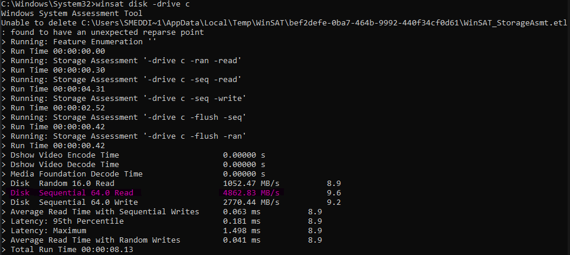

# Define max read of the current disk

## Command `winsat disk -drive c`
- I used the command above to calculate the read speed of the current disk.
- I run the command 5 times, the average is `4,879.346 MP/s`.

## Disks max read speed
- By knowing the max read speed of the current machine (`4,879.346 MP/s`), I can at least have a vision if the code is good or bad.

## Sample Size
- the sample that I will use for testing has 100M lines and weights `5787.15648 MB`

## Lowest time possible
- So based on the `sample's size` and the `disk's read speed ` is `1.186s`.