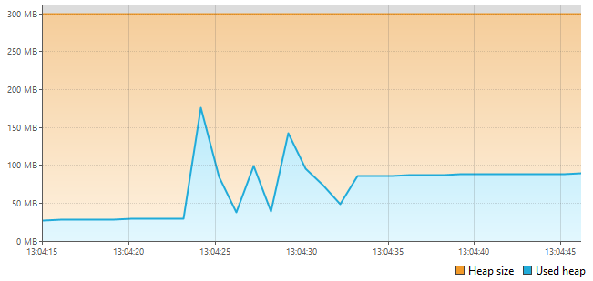
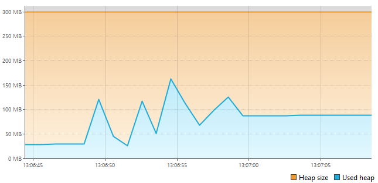
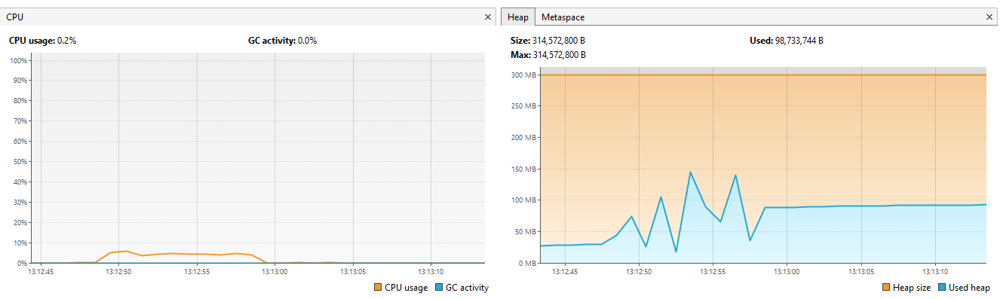
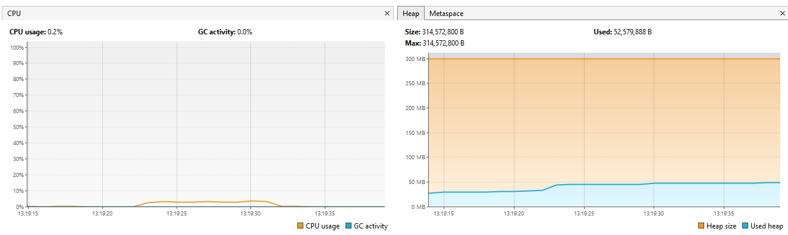

## What is an EmptyTxtFileExtractor?
- Each extractor has an empty version.
- An empty version doesn't contain the extraction and sum logic. It just goes threw the file from the beginning until the end.

## Why is there an empty version?
- an empty version helps me to conclude the cost time of:
  - Going threw the file without additional operations, using a specific java API.
  - Extraction and sum logic.

----------------------------------------------------------------------------

### EmptyStreamTxtFileExtractor

- Time: `9266 ms`
- Resource usage: lol I have no current explanation why there are a lot of spikes ↑↓

 

### EmptyBufferReaderTxtFileExtractor

- Time: `8468 ms`
- Resource: we notice a small bump in memory usage (~5MB) closer to allocation size.

