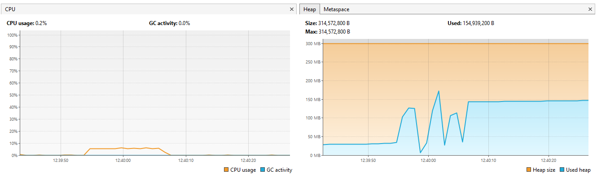
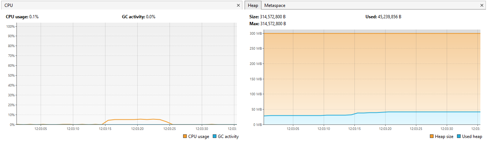

## Observations and Monitoring
- the sample that I will use for testing has 100M lines and weights `5787.15648 MB`

### BufferedWriterFileGenerator

- **Time:** `11_198 ms`
- **Resource usage:** we notice multiple spikes ↑↓

### SeekableByteChannelTxtFileGenerator

- **Time using HeapByteBuffer:** `8_301 ms`
- **Resource usage:** we notice a small bump in memory usage (~5MB) very close to allocation size (~5MB).

- **Time using DirectByteBuffer:**

---
 - Using `UUIDTool.writeUUID()`: `6_618 ms`
 - **Resource usage:** we notice that there are no spikes ↑↓ at all in memory

_memory_cpu_usage.png)

 - Using `FasterRandom.uuid().toString().getBytes()`: `7_203 ms`
 - **Resource usage:** we notice that there are memory spikes ↑↓

_memory_cpu_usage.png)
