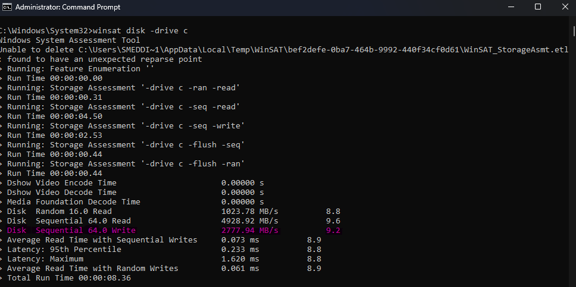

# Define max writing of the current disk

## Command `winsat disk -drive c`
- I used the command above to calculate the writing speed of the current disk.
- I run the command 5 times, the average is `2,711.338 MB/s`.

## Disks max writing speed
- By knowing the max writing speed of the current machine (`2,711.338 MB/s`), I can at least have a vision if the code is good or bad.

## Sample Size
- the sample that I will use for testing has 100M lines and weights `5787.15648 MB`

## Lowest time possible
- So based on the `sample's size` and the `disk's writing speed ` the lowest time possible is `2.134s`.